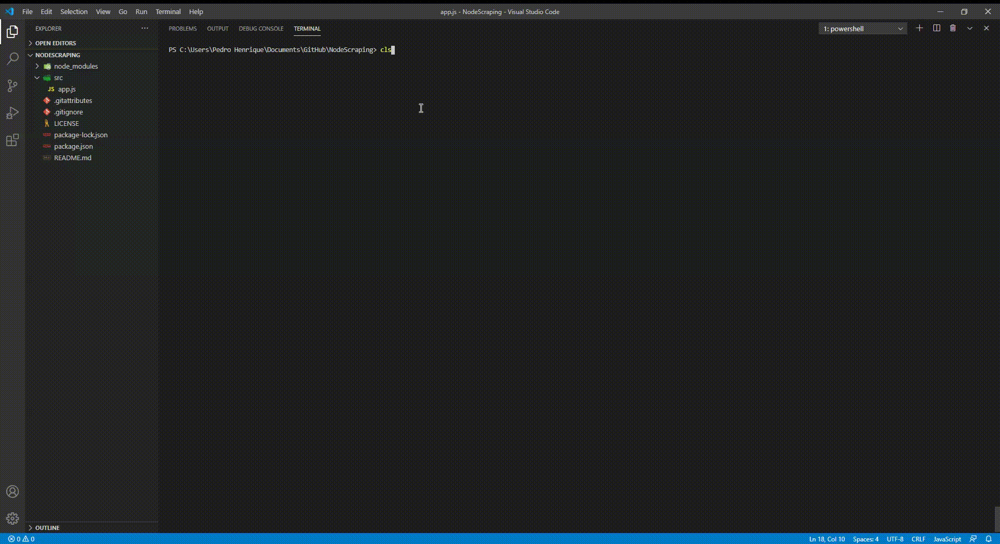

# :page_facing_up: NodeScraping
### Exemplo de Web Scraping com Node.js :fire:

#### Este repositório, tem como objetivo pegar a informação da Wikipédia sobre um termo em uma pesquisa do Google :bookmark_tabs:




# :computer: Instalação

#### 1. Instale as seguintes dependências:
- Jsdom | ```npm i jsdom```
- File get contents | ```npm i file-get-contents```

#### 2. Inicie a aplicação

```node src/app.js```
